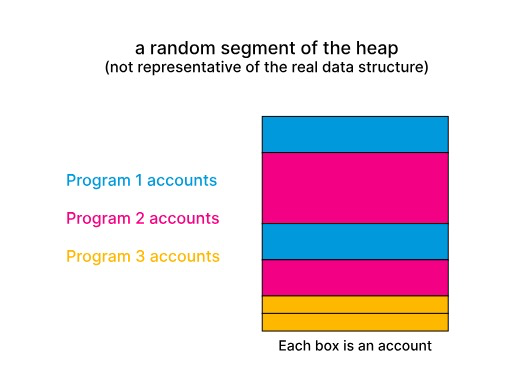
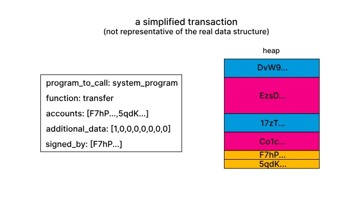

# Memory

## 内存

从高层来看，Solana 集群内的内存可以被视为一个单一的数据堆。Solana 上的智能合约（在 Solana 的术语中称为“Program”）各自拥有其数据堆的一部分。

虽然一个Program可以读取全局数据堆的任何部分，但如果尝试写入不属于自己的数据堆部分，Solana 运行时会使交易失败（有一个例外情况是增加账户的余额）。

所有状态都存储在这个数据堆中，包括你的 SOL 账户、智能合约以及智能合约使用的内存。每个内存区域都有一个管理它的Program（有时称为“owner”）。在 Solana 中，内存区域的术语是“account”。某些Program拥有成千上万个独立的account。如图所示，这些account即使由同一个Program拥有，其大小也不必相同。

由于所有状态都存在于堆中，因此甚至Program本身也存在于堆中。存储Program的account归`BPFLoader`拥有。这是一个可用于部署和升级其他程序的Program。`BPFLoader`归`Native Loader`拥有，这就是递归的结束。

## 交易和账户

您可以通过发送交易让Program读取和写入数据。Program提供了一些端点，可以通过交易调用这些端点（实际上比这更复杂，但像 Anchor 这样的框架抽象掉了这些复杂性）。一个函数的签名通常包含以下参数：

- Program在交易过程中可能读取和写入的账户。
- 函数特定的额外数据。

第一点意味着，即使理论上Program可以读取和写入全局数据堆的大部分区域，在交易的上下文中，它只能读取和写入交易参数中指定的特定区域。

> 这种设计部分是 Solana 高吞吐量的原因之一。运行时可以检查Program的所有传入交易（甚至跨程序的交易），并验证这些交易的第一个参数中指定的内存区域是否有重叠。如果没有重叠，运行时可以并行处理这些交易，因为它们之间没有冲突。更好的是，如果runtime发现两个交易访问了重叠的内存区域，但仅仅是读取而没有写入，它仍然可以并行处理这些交易，因为它们同样不会冲突。

交易究竟是如何指定内存区域或账户的呢？为回答这个问题，我们需要深入了解账户的属性（参考文档）。这是交易中账户的数据结构。`is_signer` 和 `is_writable` 字段是为每个交易设置的（例如，如果账户的密钥字段对应的私钥签署了交易，则 `is_signed` 字段会被设置），这些字段并不是保存在堆中的元数据的一部分。

在账户可以存储的用户数据（位于 `data` 字段）之前，每个账户都有一些元数据。首先，它有一个 `key` 属性，这是一个 ed25519 公钥，用作账户的地址。交易就是通过该地址来指定程序在交易中可以访问哪些账户的。

一个账户还包含一个 `lamports` 字段。由于所有状态都存储在数据堆中，普通的 SOL 账户也在堆中。它们是 `data` 字段长度为 0 的账户（尽管如此，它们仍然拥有元数据！），并且包含一定数量的 lamports。System Program是所有普通 SOL 账户的所有者。

